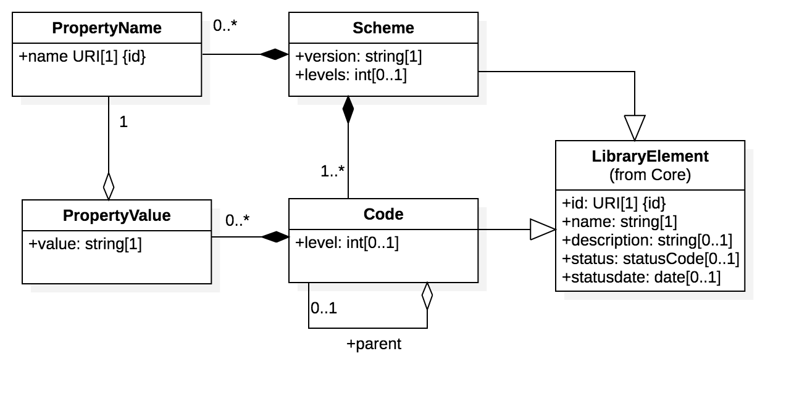

# Introduction

This specification defines a standard representation scheme for any codelist as well as transformation templates for publishing any codelist as CSV, HTML, JSON-LD, and as an Open API 3.0 end point.  It also defines a codelist maintenance model including version control and release mechanisms.


## Goals

The primary goal of this specification is to make all un/cefact codelists accessible to software developers 

* as complete codelists (in multiple formats) that can be replicated to subscriber systems - or - 
* as a REST API that can be called from within subscriber systems.

In both cases, codelists should be versioned and subscribers should be notified of new releases but should be able to use any current or historical release within their systems.


## Status

This specification is .  It will transition to  when there is at least one working implememntation.


## Glossary

Phrase | Definition
------------ | -------------
|

 
## Licence

All material published on edi3.org including all parts of this specification are the intellectual property of the UN as per the [UN/CEFACT IPR Policy](https://www.unece.org/fileadmin/DAM/cefact/cf_plenary/plenary12/ECE_TRADE_C_CEFACT_2010_20_Rev2E_UpdatedIPRpolicy.pdf).

This Specification is free software; you can redistribute it and/or modify it under the terms of the GNU General Public License as published by the Free Software Foundation; either version 3 of the License, or (at your option) any later version. See http://www.gnu.org/licenses.
 
## Change Process

This document is governed by the [2/COSS](http://rfc.unprotocols.org/spec:2/COSS/) (COSS).

## Language

The key words "MUST", "MUST NOT", "REQUIRED", "SHALL", "SHALL NOT", "SHOULD", "SHOULD NOT", "RECOMMENDED", "MAY", and "OPTIONAL" 
in this document are to be interpreted as described in RFC 2119.


# CodeList Governance

## Metamodel

In their simplest form, codelists are just a flat list of code name (eg "KG") and code description (eg "Kilogram"). However many codelists are not quite that simple. 

* Many codelists include a number of additonal properties of a code (eg "SI Unit Symbol" or "Conversion Factor"). 
* Some codelists are hierarchical (eg WTO harmonised tarriff codes) and so need to include the idea of a "level" and a link to a "parent".
* Many codes in a codelist include a lifecycle status (eg "deprecagted") and date.
* All code lists have an issuing authority, a unique identifier and a version.

In order to meet these requirements, all code list serialisations shall conform to the metamodel shown below.



## Maintenance

This section aplies only to codelists that are maintained by edi3.org. Codelists maintained by other authorities but re-published by edi3.org are transformed directly from the source format to the edi3.org canonical JSON-LD format.

Codelists are essentailly tables of business information that must be maintainable by non-technical subject matter experts. Therefore a simple and user freindly maintenance model is essential. 

The maintenance format will be as two files maintained in an repository folder within https://github.com/edi3/edi3-codelists/tree/develop/docs

* codes.csv file - with columns defined in
* scheme.json file - including the standard columns defined below plus any additonal scheme specific columns.

|Column Name | Description | Data Type| Example| Optionality|
|-----|-----|------|---|--|
|Code| the code value| string| KGM | Mandatory|
|Description| the meaning of the code |string| Kilogram| Mandatory|
|Status|The lifcycle status of the code|code - allowed values are "proposed", "stable", "depracated"| optional, if not specificed the "stable" status is assumed.|
|StatusDate| the date on which the current status became effective| date (ISO-8601 YYYY-MM-DD)| 2008-10-15| optional.|
|Level| the level in the code hierarchy|integer from 1 (top level) incrementing for each level| 1 | mandatory for hierarchical code lists. not present otherwise|
|Parent| the parent code value| 0710 (being the parent code for WTO tarif code for 171010, potatoes)| mandatory for hierarchical code lists. not present otherwise|

Any number of addiotnal columns can be added to represent additional properties of the code.  The only condition is that the column name must be defined in a scheme.json file that is maintained in the same repository folder as the codes.csv file and cannot have the same name as any of the reserved column names defined in the table above.  The scheme.json file must be the same format as the canonical representation defined in the next section.

## Canonical Representation

```
{
	"@Context":"https://edi3.org",
	"@Type":"codelist",
	"@id":"https://edi3.org/codelists/rec20",
	"name":"rec20",
	"description":"Units of measure",
	"version":"1.0",
	"levels":1,
	"status":"stable",
	"statusDate":"2018-06-01",

	"codes":[
		{
			"name":"CMQ",
			"description":"cubic centimetre,
			"sector":"Space and time",
			"quantity":"volume",
			"symbol":"cm³",
			"canonicalUnit":"MTQ",
			"conversionFactor":10E-6
		},
		{
			"name":"MTQ",
			"description":"cubic metre,
			"sector":"Space and time",
			"quantity":"volume",
			"symbol":"m³",
			"canonicalUnit":"MTQ",
			"conversionFactor":1
		}
	]
 
}
 ```

 To-Do : how to reference the JSON-LD extension of codelists @type to define the specific extra properties of the rec20 codelist (namely sector, quantity, symbol, etc)


# CodeList Publishing


